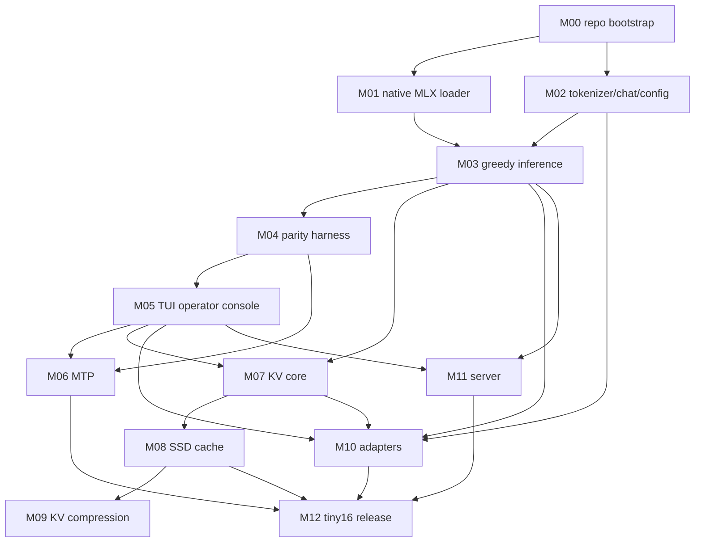

# Dependency Graph



If Mermaid is not rendered in your environment, treat this as the dependency order:

```text
M00 -> {M01, M02} -> M03 -> M04 -> M05
M04 + M05 -> M06
M03 + M05 -> M07 -> M08 -> M09
{M02, M03, M05, M07} -> M10
{M03, M05} -> M11
{M06, M08, M10, M11} -> M12
```
